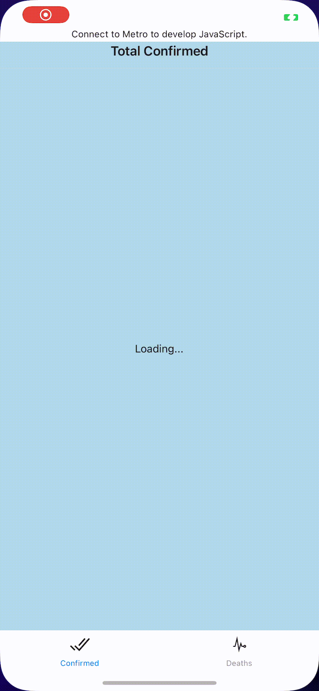
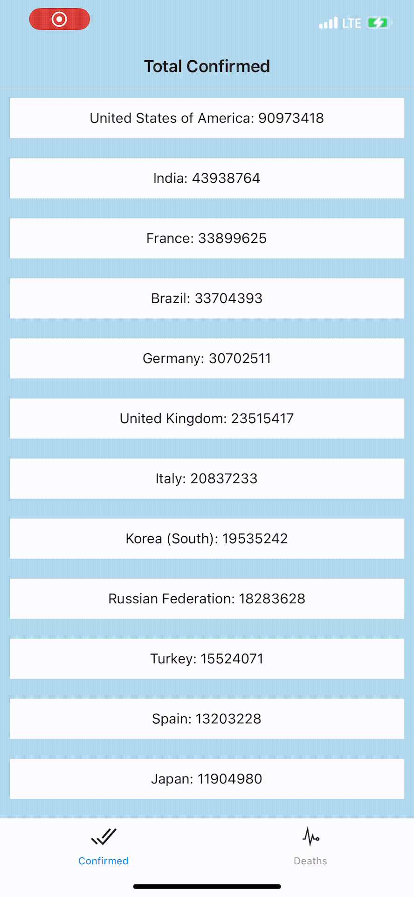
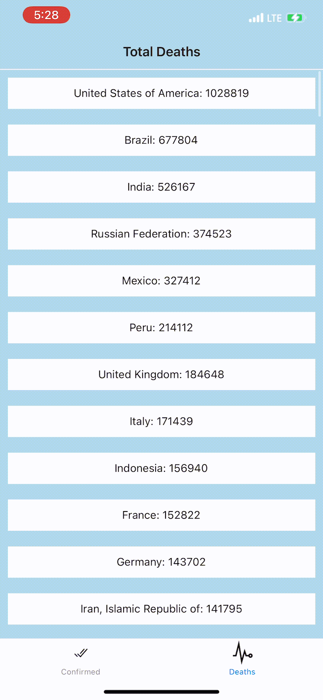

# world-covid19-application
World Covid-19 Application (from [Inflearn TS 실전 강좌](https://github.com/joshua1988/learn-typescript/tree/master/project))

## Devlopment Environment
- 
- 
- 
- 

## Mobile Application Libraries
- [React Navigation](https://reactnavigation.org)
- [Axios](https://github.com/axios/axios)
- [react-native-vector-icons(Ionicons)](https://github.com/oblador/react-native-vector-icons#bundled-icon-sets)
- [react-native-chart-kit](https://github.com/indiespirit/react-native-chart-kit)

## API
- [Coronavirus COVID19 API](https://documenter.getpostman.com/view/10808728/SzS8rjbc?version=latest)

## What it looks like
### App Start Screen

### Confirmed / Deaths Screen

### US Confirmed Screen

### Country Confirmed Screen

### Country Detailed Screen

### Country Death Screen

